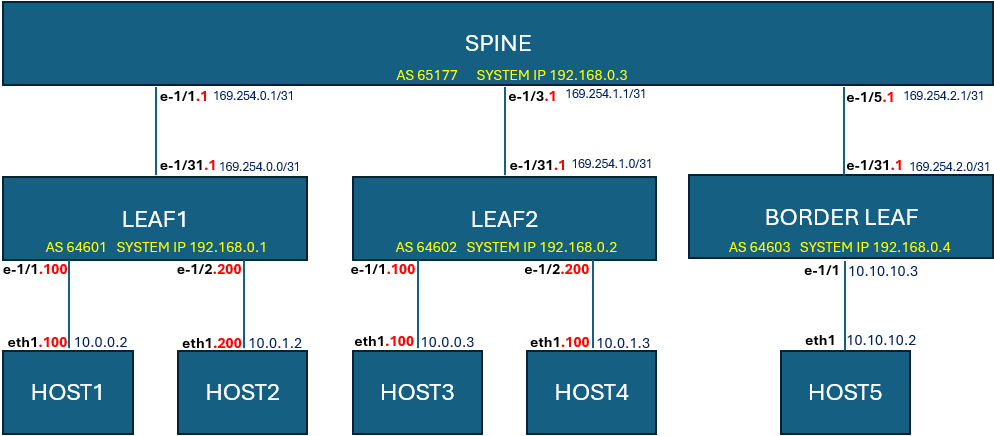

## LAB1

This Lab intends to facilitate an environment to help gain insights and practice of configuring 
services with bgp-evpn for a datacenter, with SRLinux.

The Lab Topology is below
 

 
**After cloning the repo with**
> git clone https://github.com/muzafferkahraman/dc_networking_lab

**Deploy the Lab**
> make deploy 
## Exercise-1
The Goal: Make necesary configs at Leaf1 and Leaf2 so as to make it possible to ping the IP addresses from the same MACVRF
ie
ping 10.0.0.3 from Host1
ping 10.0.1.3 from Host2
 
**Verification:** run "make verify_macvrf" 
**Hint for Steps:** 
At Leaf1 and Leaf2 Configure:  
The Interfaces for  Access (tagged with vlans),  ISL, system  
PrefixSet and Policies for BGP 
Tunnel Interface to handle vxlan with vnis 
Default Network Instance 
Mac-VRFs 
 

## Exercise-2
The Goal: Make necesary configs at Leaf1 and Leaf2 so as to make it possible to ping the IP addresses from the different MACVRF
ie
ping 10.0.1.3 from Host1
ping 10.0.0.3 from Host2
 
**Verification:** run "make verify_ipvrf" 
**Hint for Steps:** 
At Leaf1 and Leaf2 Configure: 
Irb interfaces 
Tunnel Interface to handle vxlan with vnis 
IP-VRFs 

## Exercise-3
The Goal: Make necesary configs at Border Leaf so as to make it possible to ping the routed host address 10.10.0.2  from the hosts of the Leaf1 and Leaf2
ie
ping 10.10.0.2 from Host1
ping 10.10.0.2 from Host2
 
**Verification:** run "make verify_routed" 
**Hint for Steps:** (*Configs not stated here, are already provisioned) 
At Border Leaf Configure: 
The Interfaces for  Access (routed inteface to Host5)  
Tunnel Interface to handle vxlan with vnis 
IP-VRFs 

